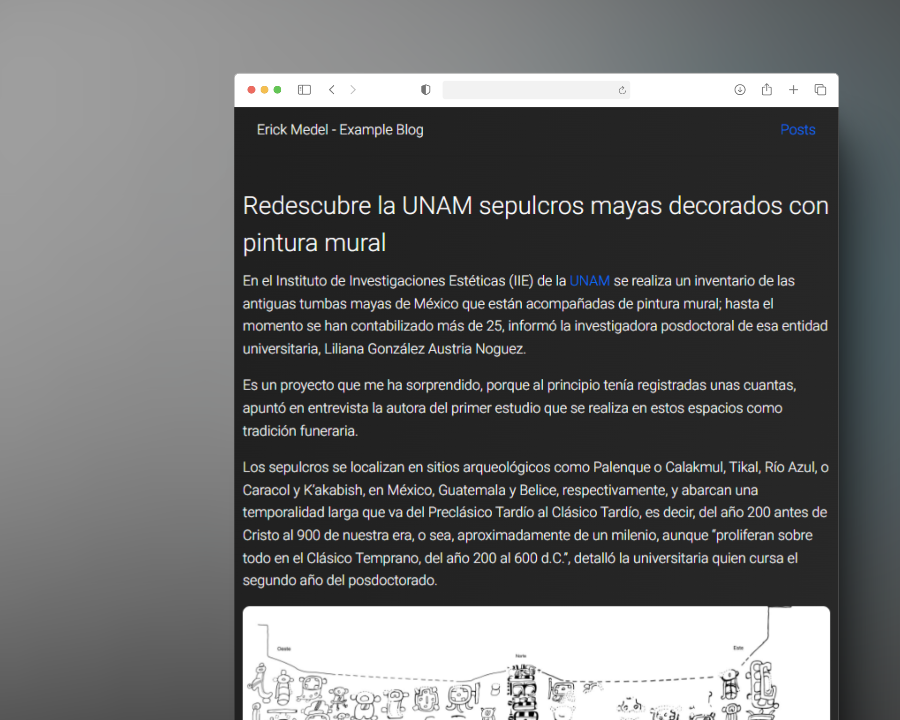

<div align="center">
  <h1>😎Example Blog</h1>
  <h2>Posts, news and more with a software developer's touch.
  </h2>
   https://eblog.erickmedel.dev

   <br/>
    <br/>

   
</div>

> [!IMPORTANT]
> This project was created with [Next.js](https://nextjs.org/) and deployed on [Vercel](https://vercel.com/) ▲.

### Features

- [x] Search Engine
  - To search for posts by title
- [x] Open Graph Protocol
  - To have a better preview when sharing the link on social networks
    
- [x] TypeScript support
  - With [ESLint](https://eslint.org/) integration for code linting
- [x] Tailwind CSS implementation
  - With [PostCSS](https://postcss.org/) integration
  - Complemented with [NextUI](https://nextui.org/)
- [x] Auto Dependency Checker
  - With [Dependabot](https://dependabot.com/) to keep dependencies up to date and prevent security vulnerabilities
- [x] Responsive design
  - To have Desktop and Mobile support
- [x] [GTM](https://tagmanager.google.com/) integration and [Google Analytics](https://analytics.google.com/)
  - To track user interactions
    
- [x] [WordPress API](https://developer.wordpress.org/rest-api/)

## Execution on local machine

> [!TIP]
> If you are using [Visual Studio Code](https://code.visualstudio.com/) you can use the [Better Comments](https://marketplace.visualstudio.com/items?itemName=aaron-bond.better-comments) extension to see the code comments in a better way.

### Requirements

- [Node.js](https://nodejs.org/en/)
- GOOGLE ANALYTICS ID
- GOOGLE TAG MANAGER ID
- WordPress API URL
- [Git](https://git-scm.com/) (optional)

### Steps

1. Clone the repository using git or download the zip file.

```bash
git clone https://github.com/ErickDevv/exampleBlog
```

2. Install the dependencies.

```bash
npm install
```

3. Create a `.env.local` file in the root directory of the project and add the following environment variables:

```bash
NEXT_PUBLIC_API_URL=
NEXT_PUBLIC_GOOGLE_ANALYTICS_ID=
NEXT_PUBLIC_GOOGLE_TAG_MANAGER_ID=
```

**_NEXT_PUBLIC_API_URL_**: The URL of the WordPress API.

**_NEXT_PUBLIC_GOOGLE_ANALYTICS_ID_**: The Google Analytics ID.

**_NEXT_PUBLIC_GOOGLE_TAG_MANAGER_ID_**: The Google Tag Manager ID.

4. Run the development server.

```bash
npm run dev
```

## LICENSE

This project is licensed under the MIT License - see the [LICENSE](LICENSE) file for details.
